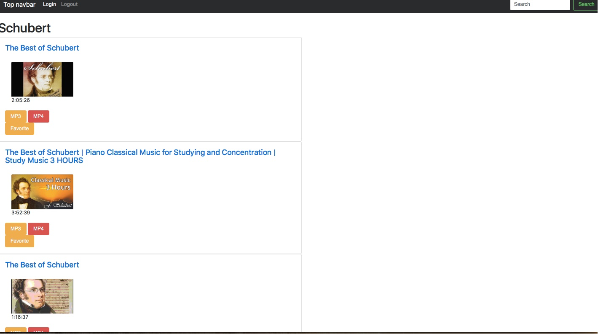

# YouTube to MP3 Web Downloader
> This project is to create a webpage which user can search and find videos of specific artist from YouTube and convert the video into mp3 and mp4 format

## Tools Used
I used PyCharm in conjunction with MongoDB (for database purposes to store favorite and login name and credentials) and Bootstrap to create this interface.

## SnapShots
Below is a snapshot of the loaded application where I searched "Schubert"

